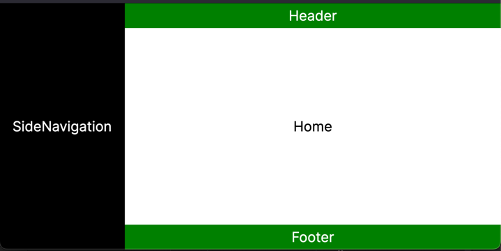

# MojoCMS

This project is a work in progress. Building a CMS for my personal website, but with the intention of making it a generic CMS that can be used by anyone.  

## Project Goals

### Frontend
- Accessibility
  - [ ] Keyboard navigation
  - [ ] Screen reader support
  - [ ] Semantic HTML
  - [ ] Proper contrast
  - [ ] Proper focus states
- A simple, clean, and responsive design
  - [x] i.e. No CSS frameworks
  - [ ] Minimal CSS styling

### Backend
- A simple, clean, and secure API
  - [ ] Authentication
  - [ ] Authorization
  - [ ] Logging
  - [ ] Error handling

### Documentation
- This project will be well documented
  - [ ] API documentation
  - [ ] Front-end documentation
  - [ ] Back-end documentation

## Running the Application

Prior to running the application, the following must be done:
- Navigate to `MojoCMS.App/` and run `npm i`
- Navigate to `MojoCMS.AppHost/` and set a password using:
  - `dotnet user-secrets set Parameters:postgresql-password <password>`

## Project Structure

- `MojoCMS.App` - The frontend application built with Next.js
- `MojoCMS.API` - The backend API built with ASP.NET 
- `MojoCMS.AppHost` - Aspire AppHost for quick development (DX QoL)
- `MojoCMS.MigrationService` - A worker service for migrating the database on start

## Screenshots

Home Page Layout (_WIP_ **2024-06-09**)

## Notes

At some point it occured to me that it might have been wiser to use a .NET frontend for this project and Next.js for my personal website. I'm thinking of sticking with Next.js on this project to continue learning Aspire's capabilities with .NET.

## License

This project is licensed under the GNU Affero General Public License v3.0 - see the [LICENSE](LICENSE) file for details.

